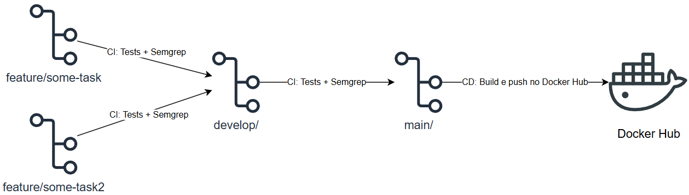

### Descrição do projeto

API REST desenvolvida em Python com FastAPI para demonstrar conceitos de
CI e CD, utilizando Pytest para testes automatizados, Semgrep para análise de segurança, e Docker para container e publicação no Docker Hub

### Pipeline:

O projeto utiliza a estratégia de branching GitFlow, com duas branches
principais:

- `main` — código de produção
- `develop` — integração das funcionalidades
- `feature/*` — desenvolvimento de novas funcionalidades

O fluxo de CI é executado em Pull Requests direcionados para `main` e `develop`, onde é realizado a execução de testes e análise de segurança

O CD é executado quando acontece um merge na branch `main`, onde é feito o build da imagem Docker, criação das tags `latest` e SHA do commit, e publicação da imagem no Docker Hub

#### Exemplo de fluxo da pipeline



### Como executar localmente

Instale as dependências:

```bash
pip install -r requirements.txt
```

Inicie a aplicação

```bash
uvicorn app.main:app --host 0.0.0.0 --port 8000
```

### Execução de testes

Para executar os testes:

```bash
python -m pytest tests/ -v
```
